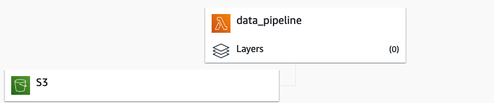

<p align="center">

<br>


</p>

---


DEBREACH.ME is a serverless Web-App built entirely using Amazon Web Services (AWS). <br>
It provides a simple solution to check if passwords were compromised in past data breaches. <br>
The DEBREACH.ME API allows direct queries to the database without the use of the UI.

The Tech-Stack consists of:

- DynamoDB
- GraphQL
- Amplify
- Lambda
- S3
- API Gateway
<span><br><br><br><br></span>

---

# The Architecture


## Data
For this app, the dataset consists of the first 80.000 entries of the open-source [HIBP-Passwords](https://haveibeenpwned.com/Passwords) dataset. The data is uploaded to the S3 bucket. Each new upload triggers a Lambda function which then loads the data (.txt - file) into the DynamoDB Table.


The function transforms the data slightly, so that it fits the DB Schema.

```Python
import json
import csv
import boto3

def lambda_handler(event, context):
    region = 'eu-central-1'
    
    try:
        s3 = boto3.client('s3')
        ddb = boto3.client('dynamodb',region_name = region)
        
        bucket = event['Records'][0]['s3']['bucket']['name']
        key = event['Records'][0]['s3']['object']['key']

        txt_file = s3.get_object(Bucket = bucket, Key = key)
        hash_list = txt_file['Body'].read().decode('utf-8').split('\n')
        
        id_val = 0

        
        for line in hash_list:
            #an entry looks like: sha1-hash:prevalence
            pwhash = line.split(':')[0]
            id_val += 1
    
    
            add_to_db = ddb.put_item(
                 TableName = XXX,
                 Item = {
                     'id': {'S': str(id_val)},
                     'pwhash': {'S': str(pwhash)}
                 }
                )
        
        
        
    
    except Exception as e:
        print(str(e))
    
    
    return {
        'statusCode': 200,
        'body': json.dumps('data_pipeline Success')
    }


```

## Database
For the Database, I opted for the NoSQL DynamoDB. The architecture is as follows:

```Js
type XXX @model @key(name: "getHash", fields: ["pwhash"], queryField: "getHash"){
  id: ID!
  pwhash: String!
}
```
To query the database by hashes, a secondary index was created on that field.

## Query
For the web-app, GraphQL is used to query the database. Although it isn't as established as REST APIs, it provides a simple solution, because it only returns needed fields. 

# API
The API is a RESTful API built using AWS API Gateway. It queries the DynamoDB directly and maps the results as follows:

```Js
#set($inputRoot = $input.path('$'))
{
    "breached": 
        #if($inputRoot.Count > 0)
            "true"
        #else
            "false"
    #end
}
```

## How to use the API?

To use the API, you have to Request 
```
https://api.debreach.me/passwords/<SHA1-HASH>
```

For example ```https://api.debreach.me/passwords/5BAA61E4C9B93F3F0682250B6CF8331B7EE68FD8``` (SHA1-HASH for 'password') returns:

```JSON
{"breached": "true"}
```

<b>Note: The API takes only sha1-hashes in uppercase!</b>